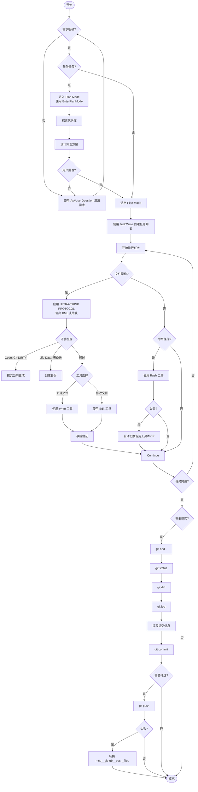

# Claude Code 项目开发流程图

> 版本：v1.0
> 创建日期：2026-01-19
> 适用场景：使用 Claude Code 开发软件项目

---

## 完整流程图



---

## 关键决策点详解

### 1. 复杂度判断

```
✅ 需要进入 Plan Mode 的情况：
- 新功能实现（影响多个文件）
- 重构现有系统
- 架构决策（多种方案可选）
- 需求不明确，需要探索

❌ 可以直接执行的情况：
- 单行/少量行修复
- 添加单个函数
- 明确的文档修改
- 用户已给出详细指令
```

### 2. ULTRA-THINK PROTOCOL 应用

**适用场景**：所有文件操作（Write/Edit）

**XML 决策块模板**：
```xml
<thinking>
  <type>CODE | LIFE_DATA | CONFIG</type>
  <git>CLEAN | DIRTY | NA</git>
  <backup>YES | NO | NA</backup>
  <tool>EDIT | WRITE</tool>
  <verify>cmd | none</verify>
  <decision>GO | STOP</decision>
</thinking>
```

**环境检查规则**：
- **CODE 类型**：Git 必须是 CLEAN 状态
- **LIFE_DATA 类型**：必须存在备份
- **CONFIG 类型**：根据重要性决定

**工具选择**：
- 新建文件 → Write
- 修改文件 → Edit

### 3. 工具失败自动切换

```
Git 推送场景：
1. 尝试：git push (Bash)
2. 失败 → 自动切换：mcp__github__push_files
3. 完成

其他场景：
- 命令失败 → 尝试 MCP 工具
- MCP 失败 → 尝试 Bash 命令
- 不报告"失败"，直接切换
```

---

## 任务管理流程

### TodoWrite 使用规范

**何时创建任务列表**：
- ✅ 任务有 ≥3 个步骤
- ✅ 非平凡且复杂的任务
- ✅ 用户明确要求使用

**何时不需要**：
- ❌ 单个简单任务
- ❌ 可在 <3 步完成
- ❌ 纯对话/信息查询

**任务状态管理**：
- 同时只有 1 个 `in_progress`
- 完成立即标记 `completed`
- 失败保持 `in_progress`，不标记 `completed`

---

## Git 操作流程

### 提交前检查

```bash
# 1. 并行执行（提高效率）
git status
git diff
git log -5

# 2. 分析变更
git diff --staged

# 3. 撰写提交信息
git commit -m "$(cat <<'EOF'
<提交信息>

Co-Authored-By: Claude Sonnet 4.5 <noreply@anthropic.com>
EOF
)"

# 4. 推送（失败自动切换 MCP）
git push
```

### 提交信息规范

**格式**：
```
<类型>: <简短描述>

<详细说明>

Co-Authored-By: Claude Sonnet 4.5 <noreply@anthropic.com>
```

**类型标签**：
- `Add:` 新增功能
- `Fix:` 修复问题
- `Update:` 更新现有功能
- `Refactor:` 重构代码
- `Optimize:` 性能优化
- `Docs:` 文档更新

---

## 文件生成规则

### 存放位置决策

```
判断流程：
1. 用户指定路径？ → 用用户路径
2. 是项目文件？ → 放项目目录
3. 否则 → Si Yuan\claude\
```

### 文件命名规范

- 使用中文文件名
- 格式：`主题_类型_YYYY-MM-DD.md`
- 临时文件：`.claude-temp/`

---

## 常见场景流程

### 场景1：Bug 修复（简单）

```
1. 读取问题代码（Read）
2. 直接修复（Edit）
3. 验证修复（运行测试/检查）
4. 提交更改（git commit）
```

### 场景2：新功能开发（复杂）

```
1. 进入 Plan Mode
2. 探索代码库，理解现有架构
3. 设计实现方案
4. 用户批准后退出 Plan Mode
5. 创建任务列表（TodoWrite）
6. 逐步实现（每个任务标记 in_progress → completed）
7. 测试验证
8. 提交推送
```

### 场景3：文档生成

```
1. 确认文档类型（项目/非项目）
2. 选择存放路径
3. 生成内容
4. 验证格式和内容
5. 如果是项目文档 → 提交到 Git
```

---

## 并行操作规则

### 可以并行的操作

```
✅ 读取多个独立文件：
   Read file1
   Read file2
   Read file3

✅ 执行多个独立命令：
   git status
   git diff
   git log

✅ 搜索不同位置的代码：
   Grep pattern1
   Grep pattern2
   Grep pattern3
```

### 必须串行的操作

```
❌ 依赖关系的操作：
   Write config.json
   Read config.json  ← 必须等 Write 完成

❌ Git 操作：
   git add .
   git commit       ← 必须等 add 完成
   git push         ← 必须等 commit 完成
```

---

## 错误处理流程

### 文件操作错误

```
1. 检查错误类型
2. 如果是路径问题 → 验证路径存在
3. 如果是权限问题 → 提示用户
4. 如果是工具问题 → 尝试备用工具
5. 记录到 TodoWrite（不标记完成）
```

### Git 操作错误

```
1. 检查错误类型
2. 如果是冲突 → 解决冲突
3. 如果是网络问题 → 切换 MCP 工具
4. 如果是配置问题 → 提示用户配置
5. 重试一次，失败则停止
```

---

## 回答规范

### 事实性问题

```
1. 先验证（Read/Grep/Glob）
2. 确认事实后再回答
3. 不确定明确说明
4. 禁止基于推断陈述"事实"
```

### 用户偏好

```
✅ 使用中文回复所有内容
✅ 要具体化时：直接给案例/数据
✅ 减少客套话，直接回答
✅ 引用私人信息前先验证来源
```

---

## 快速参考卡片

### 工具选择

```
文件读取 → Read（不用 cat）
文件搜索 → Grep（不用 grep）
文件编辑 → Edit（不用 sed）
文件创建 → Write（不用 echo）
命令执行 → Bash
代码搜索 → Task (Explore agent)
```

### 安全规则

```
✅ 文件操作前应用 ULTRA-THINK
✅ Code 操作：Git 必须 CLEAN
✅ Life Data 操作：必须有备份
✅ 验证引用信息的来源
```

### 效率规则

```
✅ 并行执行独立操作
✅ 优先使用专用工具（不用 Bash）
✅ 立即标记完成的任务
✅ 失败后自动切换工具
```

---

**文档状态**：活跃
**更新频率**：根据实际使用反馈持续优化
**维护者**：Claude Code AI Assistant
