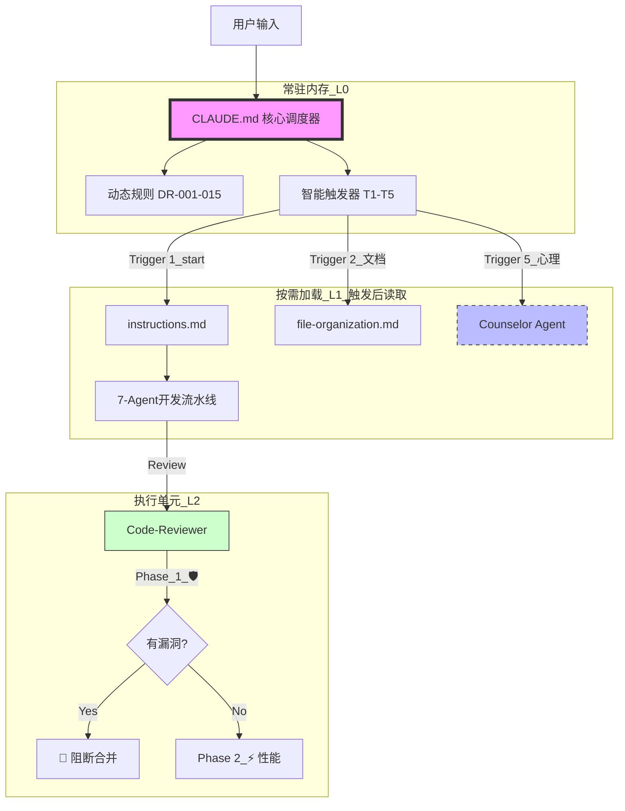

# Claude Code 系统架构设计文档

> **版本**: v1.0
> **创建时间**: 2026-01-22 17:30:00
> **状态**: ✅ 已部署

---

## 一、系统概述

本方案实现了 Claude Code CLI 工具的**最佳实践配置**，解决了三大核心痛点：

1. **上下文健忘** → 通过 `CLAUDE.md` + 智能触发器解决
2. **Token 浪费** → 通过按需加载（On-demand Loading）解决
3. **能力割裂** → 通过 Code-Reviewer 的三阶段思维链整合

---

## 二、核心架构

### 2.1 三层架构

```
┌─────────────────────────────────────────────────────────────┐
│  Layer 0: 常驻内存 (Core System)                            │
│  ┌──────────────────────────────────────────────────────┐   │
│  │ CLAUDE.md (宪法 + 调度中心)                          │   │
│  │ - 15条动态规则 (DR-001 ~ DR-015)                    │   │
│  │ - 5个智能触发器 (Trigger 1~5)                        │   │
│  │ - Safety Rules                                      │   │
│  └──────────────────────────────────────────────────────┘   │
└─────────────────────────────────────────────────────────────┘
                           ↓ 触发
┌─────────────────────────────────────────────────────────────┐
│  Layer 1: 按需加载 (On-demand Loading)                       │
│  ┌──────────────────────────────────────────────────────┐   │
│  │ instructions.md (7-Agent开发流水线)                  │   │
│  │ file-organization.md (文档规范)                      │   │
│  │ psychological-counselor-v2.5.prompt.md (心理咨询)    │   │
│  └──────────────────────────────────────────────────────┘   │
└─────────────────────────────────────────────────────────────┘
                           ↓ 调用
┌─────────────────────────────────────────────────────────────┐
│  Layer 2: 执行单元 (Agent System)                            │
│  ┌─────────┬─────────┬─────────┬─────────┬─────────┐       │
│  │Product  │Architect│Frontend │ Backend │Reviewer │       │
│  └─────────┴─────────┴─────────┴─────────┴─────────┘       │
│                           ↓                                   │
│  ┌──────────────────────────────────────────────────────┐   │
│  │ Code-Reviewer (三阶段思维链)                        │   │
│  │ Phase 1: 🛡️ Security → 阻断机制                    │   │
│  │ Phase 2: ⚡ Performance → 优化建议                   │   │
│  │ Phase 3: 🎨 Quality → 改进建议                      │   │
│  └──────────────────────────────────────────────────────┘   │
└─────────────────────────────────────────────────────────────┘
```

---

## 三、智能触发器系统

### 3.1 触发器清单

| 触发器 | 触发条件 | 加载文件 | 用途 |
|--------|----------|----------|------|
| **Trigger 1** | `/start`, "新建项目" | instructions.md | 启动开发流水线 |
| **Trigger 2** | "生成文档" | file-organization.md | 文档规范 |
| **Trigger 3** | `/clear` 后继续 | docs/INDEX.md | 上下文恢复 |
| **Trigger 5** | "心理分析", "MBTI" | counselor.prompt.md | 个人分析 |

### 3.2 触发器设计原则

#### 原则1: 物理隔离
```markdown
Trigger 1 (开发流水线) ≠ Trigger 5 (心理咨询)

好处：
- 写代码时，不会有心理学Prompt干扰
- 咨询时，不会有代码规范干扰
= 完美的上下文卫生（Context Hygiene）
```

#### 原则2: 防误触
```markdown
Trigger 1 排除条件：
❌ "什么是project" (询问概念)
❌ "我的project是..." (描述现状)
✅ "创建一个新project" (明确动作)
```

#### 原则3: 降级策略
```markdown
Code-Reviewer Token限制：
- 优先输出 Phase 1 (🛡️ Security) + Phase 2 (⚡ Performance)
- Phase 3 (🎨 Quality) 空间不足时简化或省略
= 确保关键信息不被截断
```

---

## 四、Code-Reviewer 三阶段思维链

### 4.1 核心设计

**为什么不拆分Agent？**

```
方案A（当前）: 1个Agent + 三阶段思维链
输入 "审查代码" → 输出完整报告（安全+性能+质量）
效率: ⭐⭐⭐⭐⭐

方案B（拆分）: 3个Agent
输入 "审查代码" → 调用Security → 调用Performance → 调用Quality
效率: ⭐⭐ (3次上下文切换)
```

**结论**: CLI工具中，回合数（Turn-taking）是最大成本

### 4.2 思维链流程

```
┌─────────────────────────────────────────────────┐
│ Phase 1: 🛡️ Security (Priority 0)               │
│ ├─ SQL/NoSQL注入                                 │
│ ├─ XSS/CSRF                                     │
│ ├─ 敏感信息泄露                                  │
│ └─ 认证授权缺陷                                  │
│                                                  │
│ ↓ 发现漏洞？ → 🔴 阻断审查，立即报告             │
│ ↓ 无漏洞                                         │
├─────────────────────────────────────────────────┤
│ Phase 2: ⚡ Performance (Priority 1)             │
│ ├─ N+1查询问题                                   │
│ ├─ 缺少索引                                      │
│ ├─ 缓存策略                                      │
│ └─ 算法复杂度                                    │
│                                                  │
│ ↓ 发现瓶颈？ → ⚠️ 优化建议                        │
│ ↓ 无瓶颈                                         │
├─────────────────────────────────────────────────┤
│ Phase 3: 🎨 Quality (Priority 2)                 │
│ ├─ 代码可读性                                    │
│ ├─ 代码异味                                      │
│ ├─ 测试覆盖                                      │
│ └─ 不可变性检查                                  │
│                                                  │
│ ↓ 输出完整报告                                    │
└─────────────────────────────────────────────────┘
```

### 4.3 阻断机制

**立即阻断的场景**（Phase 1）：
- SQL注入、命令注入、XSS漏洞
- 硬编码密钥/密码
- 弱密码哈希（MD5/SHA1）
- 无认证的敏感操作

**作用**：防止AI为了"讨好用户"而忽略严重漏洞去修改变量名

---

## 五、双轨制架构

### 5.1 轨道划分

```
轨道A: 软件开发流水线
├─ Trigger 1 自动激活
├─ 7个Agent协作
├─ 完整的SDLC流程
└─ 目标: 高质量代码交付

轨道B: 个人分析系统
├─ Trigger 5 自动激活
├─ Counselor Agent独立运行
├─ MBTI/执行力/关系分析
└─ 目标: 自我认知提升
```

### 5.2 互不干扰

```
开发场景：
用户: "我要做一个贪吃蛇游戏"
AI: Trigger 1 → instructions.md → product-agent → 需求分析

咨询场景：
用户: "分析我的执行力问题"
AI: Trigger 5 → counselor.prompt.md → counselor → 个人分析
```

---

## 六、文件组织结构

### 6.1 目录树

```
D:\cursor\file\
├── .claude/
│   ├── instructions.md (7-Agent定义)
│   ├── rules/
│   │   ├── dynamic_rules.md (参考，已集成到CLAUDE.md)
│   │   ├── file-organization.md
│   │   ├── dialogue-review-and-auto-update.md
│   │   └── archived_rules.md
│   └── skills/
│       ├── dialogue-optimizer/
│       ├── kaizen/
│       ├── brainstorming/
│       ├── file-organizer/
│       └── tapestry/
├── multi-agent-system/
│   ├── agents/
│   │   ├── product.prompt.md
│   │   ├── architect.prompt.md
│   │   ├── backend.prompt.md
│   │   ├── frontend.prompt.md
│   │   ├── code-reviewer.prompt.md (三阶段思维链)
│   │   ├── docs.prompt.md
│   │   ├── devops.prompt.md
│   │   └── psychological-counselor-v2.5.prompt.md
│   └── shared/
│       └── agent-work-principles.md
├── Si Yuan/
│   └── claude/
│       ├── 01_个人分析/
│       ├── 02_知识库/
│       ├── 03_项目记录/
│       └── 04_系统开发/
└── CLAUDE.md (宪法 + 15条动态规则 + 5个触发器)
```

### 6.2 核心文件说明

| 文件 | 大小 | 作用 | 加载方式 |
|------|------|------|----------|
| **CLAUDE.md** | ~4KB | 核心：规则+触发器 | 常驻内存 |
| **instructions.md** | ~22KB | 7-Agent定义 | 按需加载 |
| **code-reviewer.prompt.md** | ~10KB | 三阶段审查 | 按需加载 |
| **counselor.prompt.md** | ~3KB | 心理咨询 | 按需加载 |

---

## 七、动态规则系统

### 7.1 15条规则分类

#### 最高优先级 (Priority: highest)
- DR-001: 强制中文回复
- DR-002: 工具失败自动切换
- DR-004: 引用私人信息前必须验证
- DR-006: 极端高效对话风格
- DR-007: 结合用户个人特征而非泛化理论
- DR-008: Agent vs Skill的区别
- DR-009: 每个对话结束时记录到临时文档
- DR-010: 禁止武断下结论

#### 高优先级 (Priority: high)
- DR-003: 具体化响应策略
- DR-011: 方案设计先给列表再详细
- DR-012: 文档时间戳包含时分秒
- DR-014: 评估关键词默认使用dialogue-optimizer
- DR-015: 创建Skill/Agent时同步添加触发器

#### 中优先级 (Priority: medium)
- DR-005: 多文档生成时的内容重复处理

### 7.2 规则演化机制

```
对话中识别模式 → 频率≥3 或 Token节省≥20%
→ 提出新规则 → 用户确认
→ 添加到 CLAUDE.md → 下次对话自动生效
```

---

## 八、已解决的关键问题

### 8.1 幽灵Agent问题

**问题**：instructions.md 声称有8个Agent，实际只有5个对应文件

**解决**：
- 删除 integration-agent, qa-agent, red-team-agent
- 将职责合并到 code-reviewer
- 更新为 7个Agent配置

**效果**：文档与实际一致，避免触发器报错

### 8.2 懒加载问题

**问题**：`.claude/rules/dynamic_rules.md` 作为参考资料不会被自动加载

**解决**：将13条动态规则直接集成到 CLAUDE.md

**效果**：所有规则在每次对话中自动生效

### 8.3 Code-Reviewer职责过载

**问题**：6大职责可能导致审查不够深入

**解决**：
- 不拆分Agent（避免上下文切换成本）
- 采用三阶段思维链强制检查
- 添加优先级阻断机制
- 添加Token降级策略

**效果**：深度审查 + 高效体验

---

## 九、性能优化策略

### 9.1 Token 经济性

| 策略 | Token节省 | 适用场景 |
|------|-----------|----------|
| **按需加载** | ~20KB | 日常对话 |
| **三阶段思维链** | ~5KB | 代码审查（避免3次调用） |
| **Token降级** | ~2KB | 大文件审查 |
| **分组输出** | ~10% | 报告可读性 |

### 9.2 上下文管理

```
短对话 (< 10k tokens):
├─ CLAUDE.md + 15条规则 (常驻)
└─ 按需加载触发器

长对话 (> 50k tokens):
├─ 触发 DR-009: 记录到 .claude-temp/
├─ /clear 清理上下文
└─ 触发 Trigger 3: 恢复上下文
```

---

## 十、使用指南

### 10.1 快速开始

#### 开发新项目
```bash
# 任意一个命令即可
"我要做一个贪吃蛇游戏"
"/start"
"新建一个web应用"

# AI自动执行
Trigger 1 → instructions.md → product-agent → 需求分析
```

#### 代码审查
```bash
"检查这段代码的安全性"
"review一下，看看有没有漏洞"
"帮我优化性能"

# AI自动执行
code-reviewer → Phase 1 (安全) → Phase 2 (性能) → Phase 3 (质量)
```

#### 个人分析
```bash
"分析我的执行力"
"我做MBTI测试是什么结果"
"为什么我总是拖延"

# AI自动执行
Trigger 5 → counselor.prompt.md → 心理分析
```

### 10.2 注意事项

1. **触发器误触**：如果误触发，直接说"这不是XXX任务"，AI会停止
2. **Token截断**：大文件审查时，如果Phase 3被截断，回复"继续Phase 3"
3. **规则失效**：新对话窗口中如果规则没生效，检查 CLAUDE.md 是否被正确加载

---

## 十一、维护指南

### 11.1 新增Agent流程

```
1. 创建 agent.prompt.md
2. 在 CLAUDE.md 添加 Trigger X
3. 更新 instructions.md (如果是开发Agent)
4. 提交并推送
```

### 11.2 新增动态规则流程

```
1. 识别重复模式 (频率≥3)
2. 起草规则 (YAML格式)
3. 添加到 CLAUDE.md
4. 提交并推送
```

### 11.3 定期维护

- **每月1号**: 检查文件夹结构，删除重复文件
- **每季度**: 归档3个月前的文件（可选）
- **新增文件后**: 更新 README 索引

---

## 十二、架构优势

### 12.1 自我保护
- ✅ 安全审查（三阶段思维链）
- ✅ 阻断机制（严重漏洞立即停止）
- ✅ 工具自动切换（DR-002）

### 12.2 自我适应
- ✅ 智能触发器（按需加载）
- ✅ Token降级（大文件优化）
- ✅ 规则演化（动态更新）

### 12.3 自我约束
- ✅ 15条动态规则
- ✅ 极端高效对话风格
- ✅ 结合用户个人特征

---

## 十三、总结

这套配置实现了：

1. **功能完备性**：7个开发Agent + 1个咨询Agent
2. **Token经济性**：按需加载 + 降级策略
3. **执行效率性**：一站式审查，避免多次切换
4. **可维护性**：清晰的结构 + 完整的文档

**可以直接封版（Freeze）了。**

---

## 附录

### A. 提交历史

```
f4cfe7d Refactor: Code-Reviewer采用三阶段思维链结构
4f0a153 Feat: 清理幽灵Agent并扩充Code-Reviewer职责
681093e Feat: 新增DR-015（创建Skill/Agent时同步添加触发器）
da6c66c Feat: 添加智能触发器系统
```

### B. 参考文档

- `multi-agent-system/shared/agent-work-principles.md` - Agent工作原则
- `.claude/skills/dialogue-optimizer/SKILL.md` - 对话优化协议
- `.claude/rules/file-organization.md` - 文件组织规则

### C. Mermaid架构图



---

**文档维护**: 当架构发生重大变更时更新此文档
