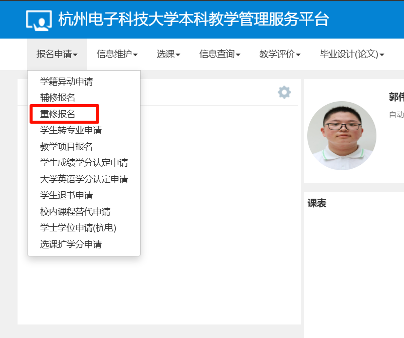
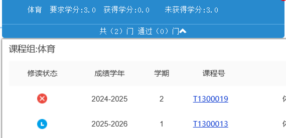
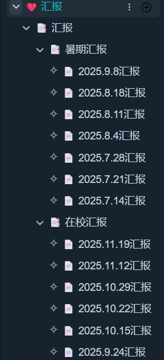

	辛苦洪哥，打扰您宝贵的时间，有几个学业和个人发展相关的问题想向您请，总结为以下三者：

1.课程重修 2.企业导师制咨询 3.未来方向迷茫

## 1.课程重修问题

	由于大一下参与活动过多，心也未收回来，所以挂了2门课：高数和体育

### 困惑一：高数如何重修，要求如何

	想请教洪哥：

1.重修申请是否是在教务系统的**这个界面**，

2.重修报名时间是在之后选课时期吗，或**何时**报名

3.报名的课程是否有什么**要求**例如任课老师与大一相同

### 困惑二：**大一下体育挂科重修事宜**

体育挂科应该**重修挂科的科目**呢，还是可以选择不重修，直接在选课阶段重新选足够把学分修满的体育课

## 2.企业导师

##### 上次听您在形策课上分享过多件事情，其中对两个印象比较深刻：

##### 1.写下自己目前状态最好简历 2.企业导师制

### 问题：

1.想知道**如何申请**，是向洪哥报名还是推荐制还是绩点选拔还是如本科生导师制一般自己联系导师

2.想请教洪哥，如果想申请企业导师制，要**注意哪些方面，哪些事情一定要去做**

3.对于相关企业已经做了一定了解，但是不了解企业导师所带领的方向，洪哥对各导师了解更深，想请教洪哥，**对各位导师有更深的理解**，也能根据我目前的方向+洪哥的指导寻找到合适的导师

## 3.对未来方向迷茫

### 现状：

	目前我已经**挂过2门课程**，在**绩点方面不突出**，在保研方面无竞争力，根据洪哥写下自己最好简历的条件看来，**本科就业环境**也**不**是很**好**。目前我在**跟着导师做项目**，为《基于机器学习的机器人行为决策与控制方法研究》，软件层面建设**马上完毕**，将要转向硬件和实际落地。根据指导的研究生学长的建议，项目完成之后，可选择**写出一篇论文**。

	针对整体学习状态而言，**大一下**的时候处于各个事项叠加状态，学生会、社团、竞赛、导师制、班级事项、学业方面，各个事项事赶事，压力大的情况下心态趋向摆烂，**学习没有干劲**，导致挂科两门。**目前心态逐渐稳固**，各个事项稳定下来，辞去了学生会职位、从班长转为团支书、暂停竞赛事宜，将**注意力收拢**。并且导师制每周**定期组会**督促，目前**学习状态较良好**，但有**较多习惯未改正**。

（左图为自暑假起定期的小组汇报）

### 问题

1.学习方向为**机器学习（深度强化学习）** 本科阶段无就业前景，有利于研究生方向学习。目前我**专注**于**项目**的学习方向，但是该方向**要求升学**，而对于我来说就是要求考研。针对政策而言考研难度增加，并且相当于把赌注全部压在考研上，不是很保险。所以**对未来比较迷茫**，不知道应该怎么办才比较保险，想请洪哥为我引导方向。

2.**对于自动化专业理解较少，无方向**
（1）在嵌入式方面有电子信息，在软件方面有计算机，在其他领域感觉智科是自动化全方面的上位，不**知道自动化着重于什么，就业方面不知道学什么有利。**

（2）在学业情况查询中发现有不同方向，**不知道什么时候分流**，也**不知道不同方向**是什么，**侧重点**又是什么，对于各个方向来说不知道哪个方向**对就业来说更有利**，想**以就业为导向**请教洪哥以上问题。

3.**对于科研和竞赛个人无法平衡**，目前一直在做科研项目，但是在最好简历撰写时发现有些问题，部分竞赛需要时间为一两个月左右，在全心全意的情况下至少可以达到省赛奖项，但科研项目来说，目前我的项目进行半年，学长预估写论文需要一年。不太了解奖项和科研项目的对于**升学和就业**的重要性，想咨询洪哥该**如何平衡**。
