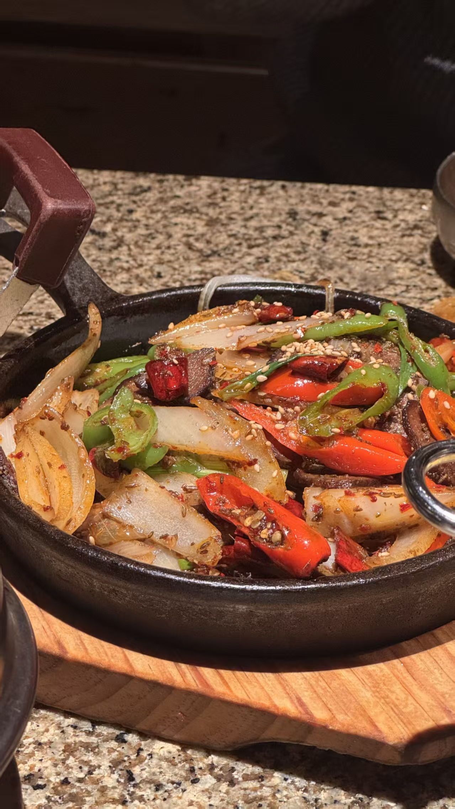
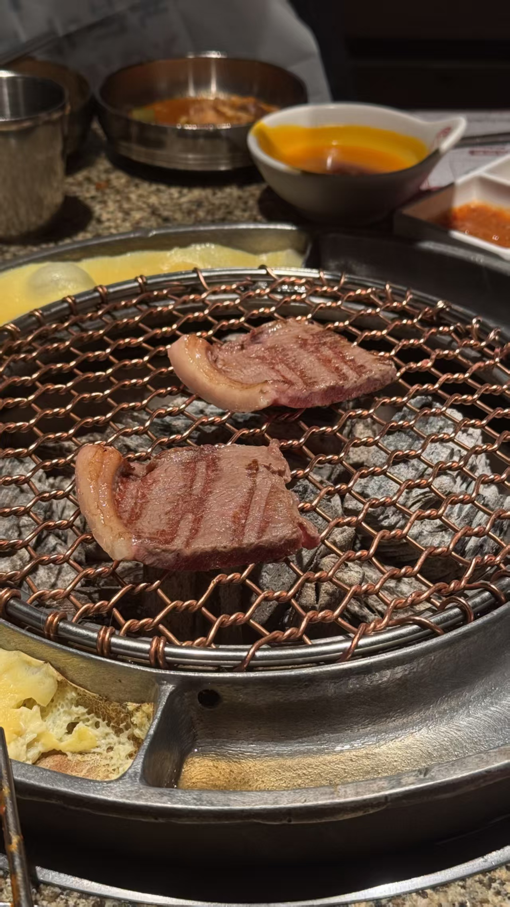
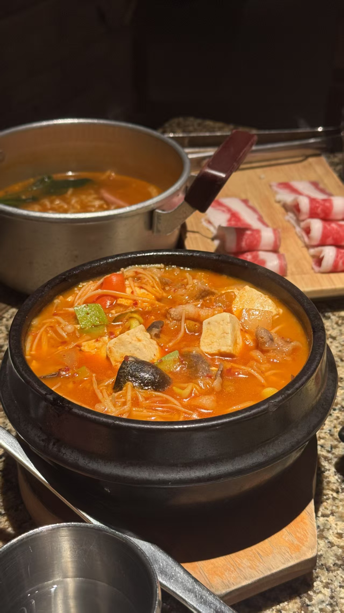
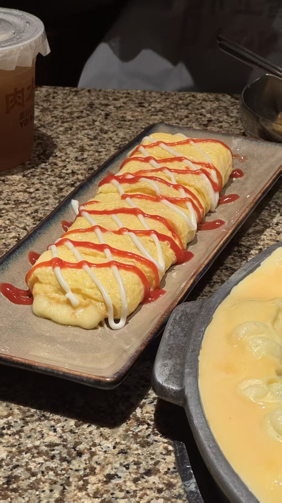
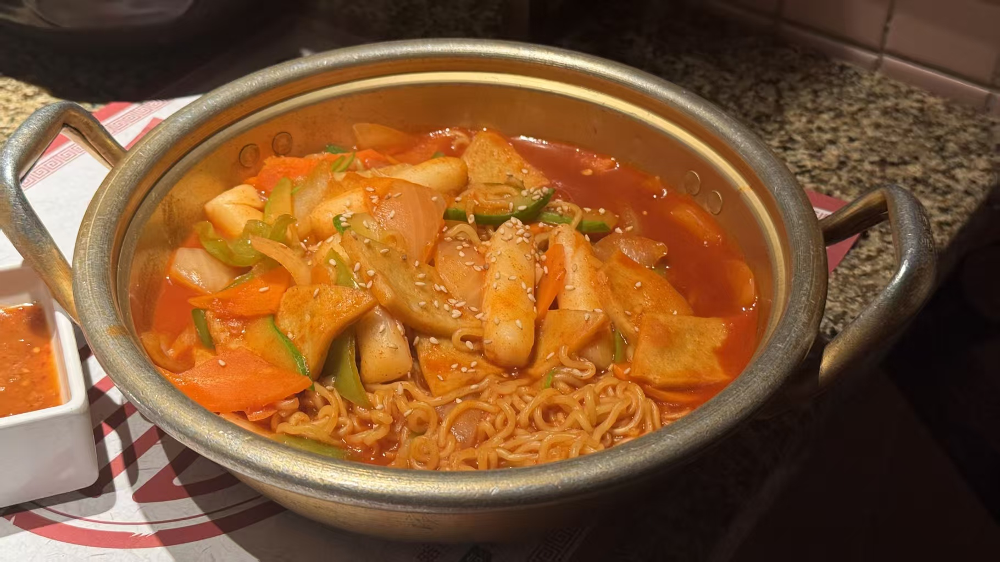
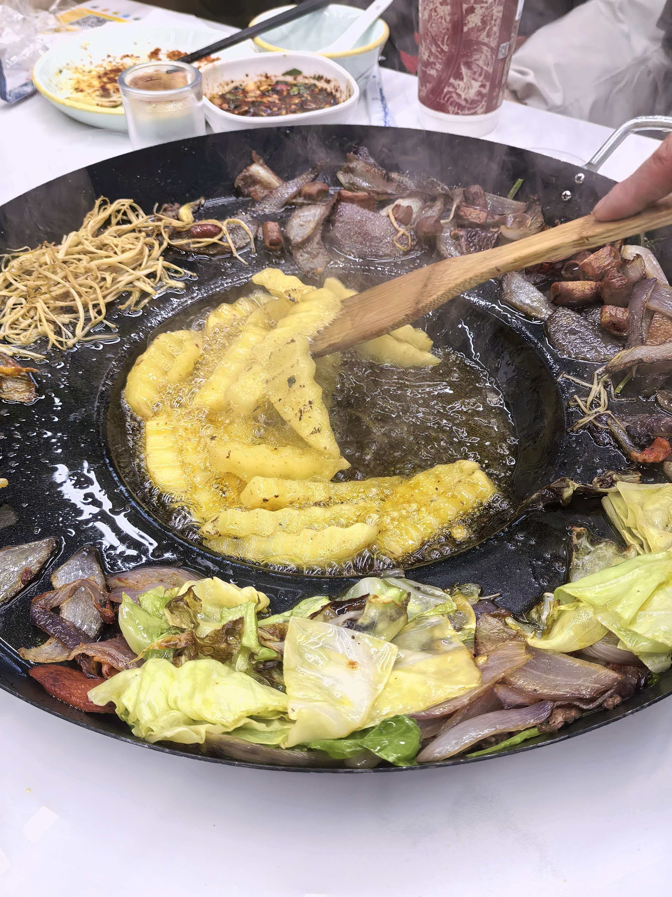
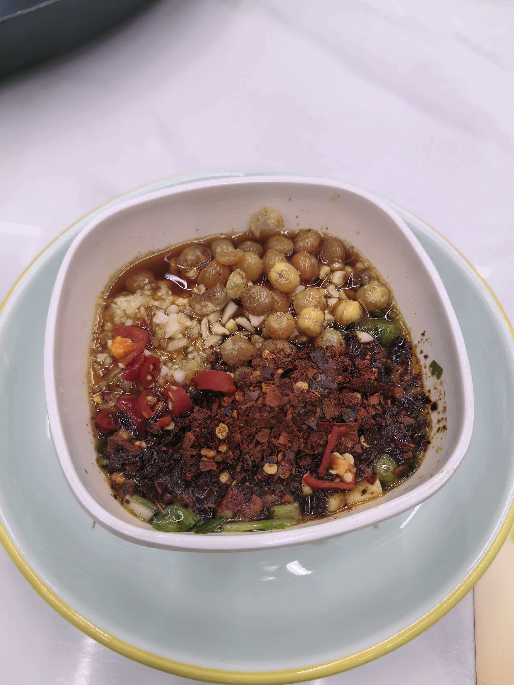
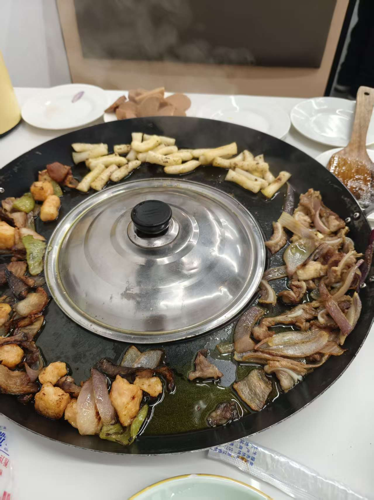
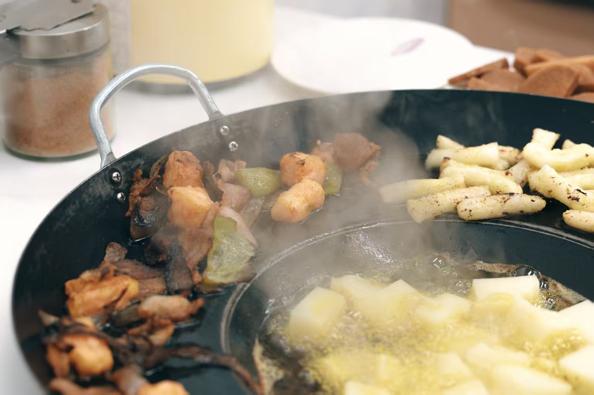

1. 很久以前

   1. 羊肉串最好吃，烤粗粉特别好吃，疙瘩汤一般般，有雪糕（味道类似小布丁）
   2. 服务巨好，会送防热贴，会帮你烤串，在串熟的情况下也会帮你取下来
   3. 桌子有丢签子的洞，餐具适合吃烤串
2. 肉本家

   1. 千万记得提前预约or排队，人巨多，六点钟去排前面会有一百多号人
   2. M5雪花牛排味道不错，肥牛薄片味道不错，炒年糕味道一般
   3. 大酱汤❌蛋卷❌
   4. 门口抽奖可以抽菜品
   5. 
3. 家常小炒

   1. 焦点每年见面会据点，适合多人尝尝
4. 王记贵州烙锅（宝龙这边）

   1. 服务不错，店里的小哥是零时工，但是有个老奶奶比较慈祥，会帮忙烤肉，不用自己来烤
   2. 味道不错，是很纯粹的油炸的味道，食材也不错，但是有一点油，店家调制的蘸料很好吃
   3. 因为是油锅焖炸，油烟味很大，回来后发现衣服裤子上全是油烟味
   4. 
5. 粮富贵
6. 许府牛火锅
