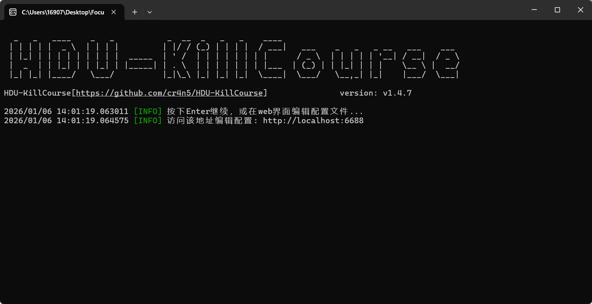
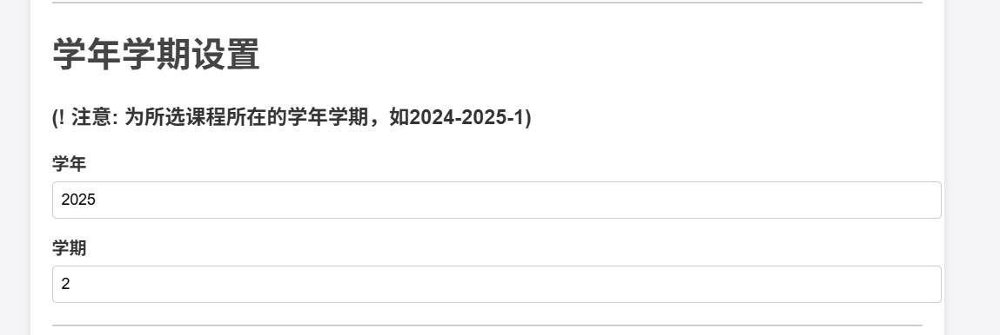
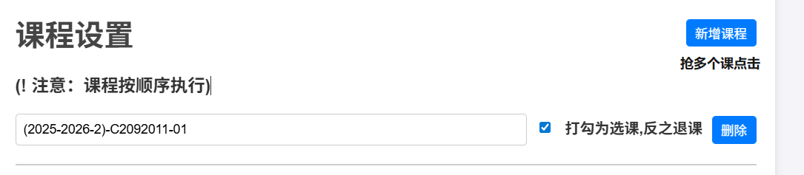
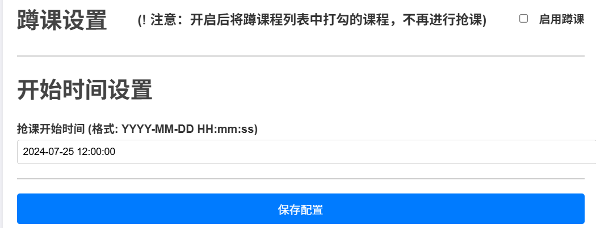
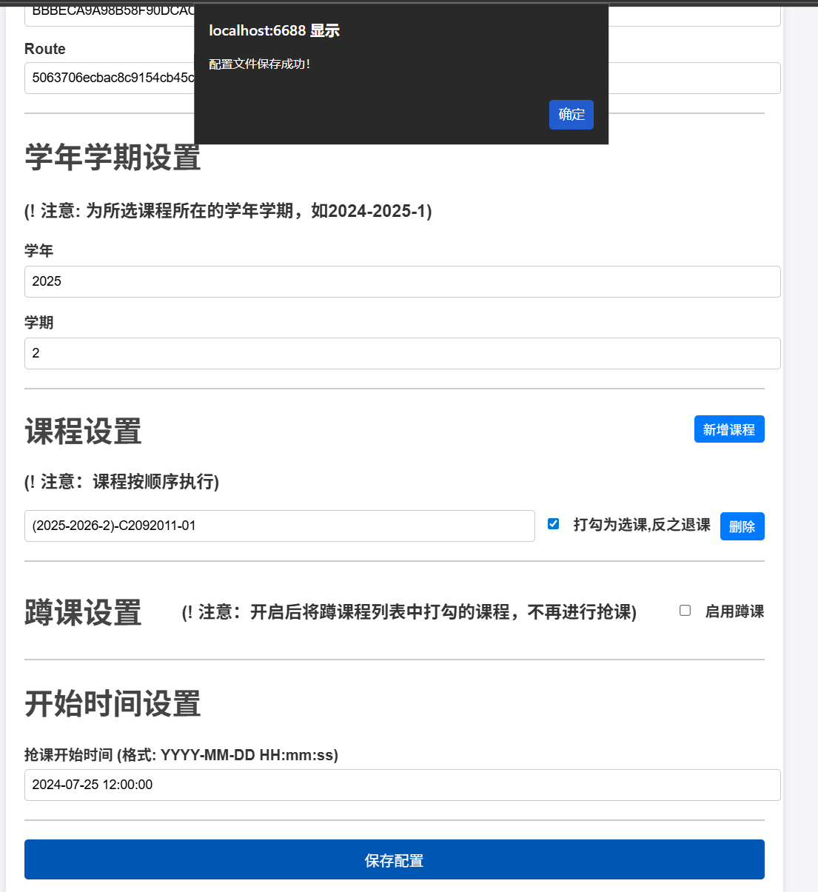
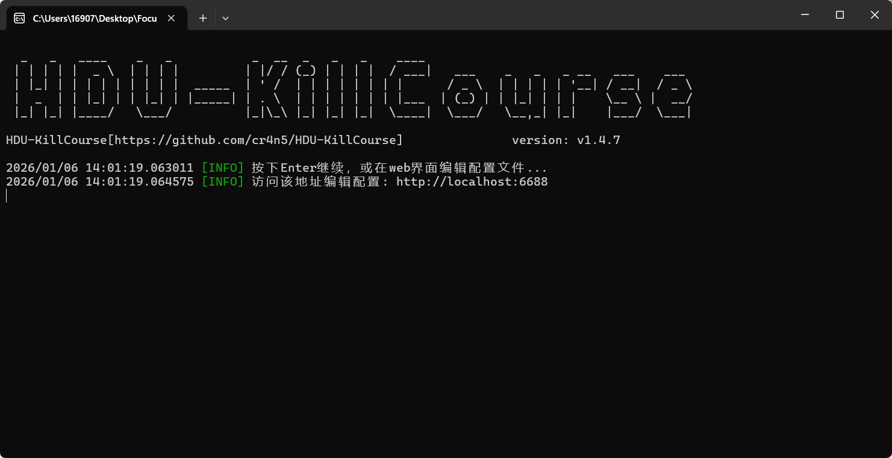

1.双击打开脚本

2.复制上面网页链接并打开

http://localhost:6688

3. 1. 填写账号与密码（只填CAS）

      
   2. 改为目前时间

      
   3. 填写要抢或退的课

      
   4. 设置开始抢课时间

      
   5. 保存

      

3.回到界面脚本界面按enter

> [!TIP]
> 课程里要抢的课可以上钉钉找杭电助手里的模拟课程（电脑开）
>
> https://cinnamon-hduhelp.hdu.edu.cn/navigation
