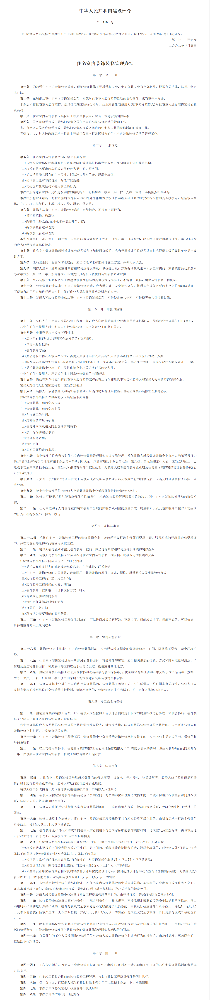
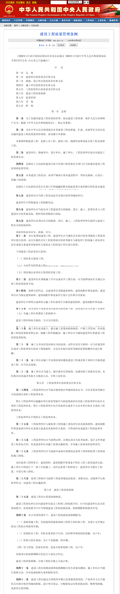

### 案件背景

被告与原告之间存在一项**没有书面合同的装修承揽关系**，其中包含了门窗的安装工作。工程于**2018年**完成。

---

### 争议焦点：门窗玻璃漏气与赔偿责任

1. **问题发现与早期沟通 (2019年-2022年)：**

   * 原告声称，门窗安装完成后不久，即在**2019年**（安装后两年内），玻璃就出现了发毛、漏气等质量问题。
   * 录音证据显示，**被告方代表**在收到原告反馈后，于**2019年至2022年**期间，多次**承认门窗存在质量问题**，并**承诺会进行更换或处理**。沟通记录表明被告方曾提议等问题扩大后一并处理。
   * 双方在此期间一直保持联系，沟通的录音记录是证明被告方承认责任和承诺履行的关键证据。
2. **联系中断与后续重提 (2022年-2025年初)：**

* 双方沟通在**2022年**后曾中断一段时间。
* 在**2025年初**，原告重新与被告方取得联系，再次要求解决门窗漏气问题。

1. **维修费用分歧与诉讼 (2024年-2025年)：**

* 根据录音，在**2024年年中**，被告方代表曾提出一个解决方案，即由原告承担约**三四千元的人工费和安装费**，原告当时对此表示**接受**。这是被告方主张合理费用分摊的重要依据。
* 然而，在**2025年初**，被告方改变了立场，提出更换玻璃需要原告承担**1万元的材料费**。被告方代表解释称，玻璃厂家一般只提供两年质保，而玻璃已使用六七年。
* 原告对此强烈反对，认为被告方出尔反尔，并坚持问题在质保期内就已提出。他认为双方争议的焦点在于约7000元的费用差额。
* 最终，原告于**2025年5月22日**向法院提起了诉讼，要求被告方承担更换玻璃的全部费用。

---

### 案件主要争议点

* **责任归属：**  门窗玻璃漏气是由于被告方的**安装工艺不当**，还是**采购的玻璃产品本身存在质量缺陷**（即使制造商是小作坊且已无法联系），或是经过多年使用后的**自然老化**和**正常损耗**？
* **质保期认定：**  被告方主张玻璃两年质保，而原告援引国家标准GB/T 11944-2012《中空玻璃》规定的“预期使用寿命至少15年”。法院将如何认定玻璃的质保期限或合理使用寿命是关键。
* **2019年承诺的性质与范围：**  被告方当时承认质量问题并承诺处理，这个承诺的法律效力、范围和期限如何界定？是否意味着被告需要承担所有后续费用，以及是否构成对诉讼时效的中断。
* **维修费用的合理性与分摊：**  原告提供的18,620元更换报价是否合理？其中是否包含将普通玻璃升级为LOW-E玻璃的费用？被告方提出的让原告承担三四千元人工费的口头约定是否有效？

---

### 被告目前面临的挑战与应对策略

1. **无书面合同：**  增加了举证难度，需依靠聊天记录和口头沟通来证明事实和约定。
2. **早期承认并承诺：**  这点对被告不利，可能被视为被告已认可自身责任，并可能导致诉讼时效重新计算（您已确认本案在诉讼时效内）。
3. **玻璃制造商无法追溯：**  难以将产品质量问题直接转嫁给制造商。

**被告方的主要应对策略应聚焦于：**

* **玻璃漏气的真正原因：**  争取通过专业鉴定，证明漏气主要由产品本身缺陷、自然老化等非被告方安装因素引起。
* **费用分摊的合理性：**  坚决主张按照2024年双方曾达成的口头约定（原告承担三四千元人工费）或类似的比例进行分摊，并指出原告更换LOW-E玻璃的升级费用应由其承担。
* **利用所有沟通记录：**  仔细梳理所有聊天和录音，提取对被告方有利的细节，例如原告接受过部分费用分摊的提议，或证明被告方在解决问题上曾有积极意愿。

目前案件已进入司法程序，被告已收到应诉通知书。 **最关键的下一步是立即委托专业律师，并准备详细的答辩状及所有相关证据，积极应诉。**  律师将帮助被告方制定详细的庭审策略，并在法庭上为您争取最大权益。

即使没约定，也有“默认保修期” 根据《住宅室内装饰装修管理办法》第32条： 在正常使用条件下，住宅装修工程的最低保修期限为2年，防渗漏工程为5年，从竣工验收合格之日起算。

